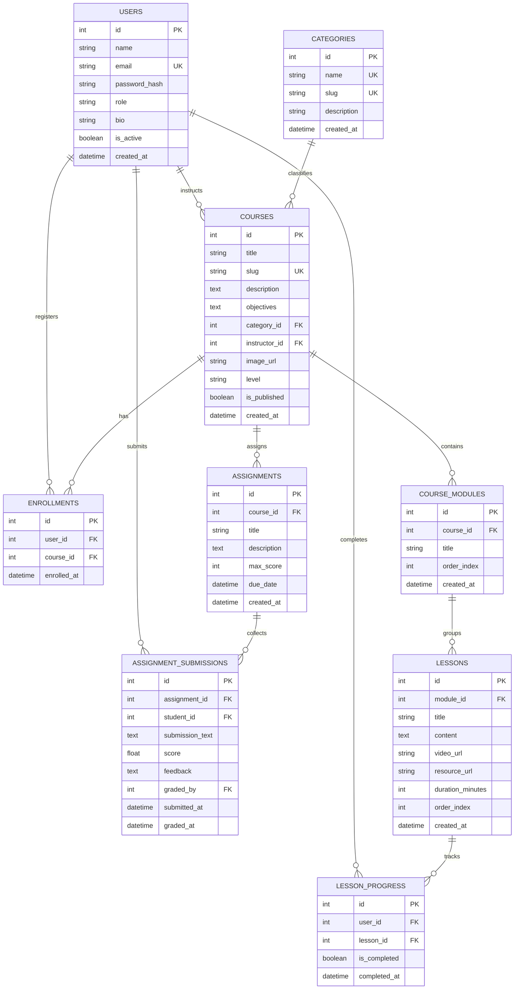

# Entity Relationship Diagram (ERD)

```mermaid
erDiagram
    USERS ||--o{ COURSES : "instructs"
    USERS ||--o{ ENROLLMENTS : "registers"
    USERS ||--o{ LESSON_PROGRESS : "completes"
    USERS ||--o{ ASSIGNMENT_SUBMISSIONS : "submits"
    CATEGORIES ||--o{ COURSES : "classifies"
    COURSES ||--o{ COURSE_MODULES : "contains"
    COURSES ||--o{ ENROLLMENTS : "has"
    COURSES ||--o{ ASSIGNMENTS : "assigns"
    COURSE_MODULES ||--o{ LESSONS : "groups"
    LESSONS ||--o{ LESSON_PROGRESS : "tracks"
    ASSIGNMENTS ||--o{ ASSIGNMENT_SUBMISSIONS : "collects"

    USERS {
        int id PK
        string name
        string email UK
        string password_hash
        string role
        string bio
        boolean is_active
        datetime created_at
    }

    CATEGORIES {
        int id PK
        string name UK
        string slug UK
        string description
        datetime created_at
    }

    COURSES {
        int id PK
        string title
        string slug UK
        text description
        text objectives
        int category_id FK
        int instructor_id FK
        string image_url
        string level
        boolean is_published
        datetime created_at
    }

    COURSE_MODULES {
        int id PK
        int course_id FK
        string title
        int order_index
        datetime created_at
    }

    LESSONS {
        int id PK
        int module_id FK
        string title
        text content
        string video_url
        string resource_url
        int duration_minutes
        int order_index
        datetime created_at
    }

    ENROLLMENTS {
        int id PK
        int user_id FK
        int course_id FK
        datetime enrolled_at
    }

    LESSON_PROGRESS {
        int id PK
        int user_id FK
        int lesson_id FK
        boolean is_completed
        datetime completed_at
    }

    ASSIGNMENTS {
        int id PK
        int course_id FK
        string title
        text description
        int max_score
        datetime due_date
        datetime created_at
    }

    ASSIGNMENT_SUBMISSIONS {
        int id PK
        int assignment_id FK
        int student_id FK
        text submission_text
        float score
        text feedback
        int graded_by FK
        datetime submitted_at
        datetime graded_at
    }
```
