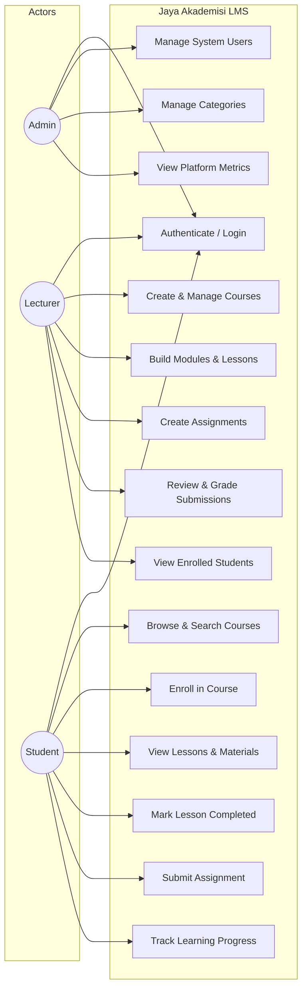

# Use Case Analysis & Diagram

```mermaid
flowchart LR
    subgraph Actors
        Admin((Admin))
        Lecturer((Lecturer))
        Student((Student))
    end

    subgraph "Jaya Akademisi LMS"
        UC1[Authenticate / Login]
        UC2[Browse & Search Courses]
        UC3[Enroll in Course]
        UC4[View Lessons & Materials]
        UC5[Mark Lesson Completed]
        UC6[Submit Assignment]
        UC7[Track Learning Progress]

        UC8[Create & Manage Courses]
        UC9[Build Modules & Lessons]
        UC10[Create Assignments]
        UC11[Review & Grade Submissions]
        UC12[View Enrolled Students]

        UC13[Manage System Users]
        UC14[Manage Categories]
        UC15[View Platform Metrics]
    end

    Student --> UC1
    Student --> UC2
    Student --> UC3
    Student --> UC4
    Student --> UC5
    Student --> UC6
    Student --> UC7

    Lecturer --> UC1
    Lecturer --> UC8
    Lecturer --> UC9
    Lecturer --> UC10
    Lecturer --> UC11
    Lecturer --> UC12

    Admin --> UC1
    Admin --> UC13
    Admin --> UC14
    Admin --> UC15
```
